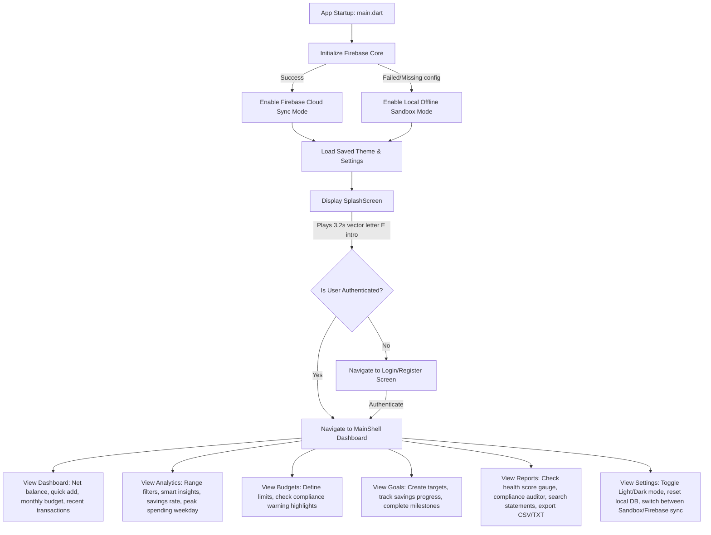

# 📊 Expense Tracker - Premium Wealth Intelligence & Personal Finance

<p align="center">
  
  
  
  
</p>

```
███████╗██╗  ██╗██████╗ ███████╗███╗   ██╗███████╗███████╗    ████████╗██████╗  █████╗  ██████╗██╗  ██╗███████╗██████╗ 
██╔════╝╚██╗██╔╝██╔══██╗██╔════╝████╗  ██║██╔════╝██╔════╝    ╚══██╔══╝██╔══██╗██╔══██╗██╔════╝██║ ██╔╝██╔════╝██╔══██╗
█████╗   ╚███╔╝ ██████╔╝█████╗  ██╔██╗ ██║███████╗█████╗         ██║   ██████╔╝███████║██║     █████╔╝ █████╗  ██████╔╝
██╔══╝   ██╔██╗ ██╔═══╝ ██╔══╝  ██║╚██╗██║╚════██║██╔══╝         ██║   ██╔══██╗██╔══██║██║     ██╔═██╗ ██╔══╝  ██╔══██╗
███████╗██╔╝ ██╗██║     ███████╗██║ ╚████║███████║███████╗       ██║   ██║  ██║██║  ██║╚██████╗██║  ██╗███████╗██║  ██║
╚══════╝╚═╝  ╚═╝╚═╝     ╚══════╝╚═╝  ╚═══╝╚══════╝╚══════╝       ╚═╝   ╚═╝  ╚═╝╚═╝  ╚═╝ ╚═════╝╚═╝  ╚═╝╚══════╝╚═╝  ╚═╝
                                 INTELLIGENT WEALTH MANAGEMENT PORTAL
```

**Expense Tracker** is a premium personal finance application built to run fluidly on Android, iOS, Desktop, and Web. Engineered using a hybrid storage model, the app operates as a **Safe Offline Local Sandbox** by default and instantly upgrades to **Cloud-Synced Real-time Firestore Sync** when Firebase configuration keys are added. 

The user experience features a **vector-driven mathematical motion background**, customizable **Nordic Frost/Deep Navy themes**, frosted glassmorphism, category budgeting alerts, savings milestones, interactive financial audits, and statement exporters.

---

## 📖 Table of Contents
1. [Key Architectural Highlights](#-key-architectural-highlights)
2. [Deep Dive: System Features](#-deep-dive-system-features)
3. [Visual Mechanics & Design Language](#-visual-mechanics--design-language)
4. [Screenshots](#-screenshots)
5. [File & Folder Structure Directory](#-file--folder-structure-directory)
6. [Data Flow & State Lifecycle](#-data-flow--state-lifecycle)
7. [Mathematical Foundations of the Wave Canvas](#-mathematical-foundations-of-the-wave-canvas)
8. [Installation & Firebase Setup](#-installation--firebase-setup)
9. [Troubleshooting & FAQ](#-troubleshooting--faq)
10. [Performance Optimizations](#-performance-optimizations)
11. [License](#-license)

---

## ⚡ Key Architectural Highlights

* **Zero-Setup Native Runtime:** If native Google Services dependencies are missing, Dart catches native compiler hooks, initialization skips Firebase safely, and redirects directly into an offline sandbox database.
* **State Sync Bridge (Provider & ChangeNotifier):** Employs dynamic proxy providers linking the active authentication state to transactional controllers.
* **Platform Conditional Bridges:** Uses Dart conditional compilation (`file_exporter_web.dart` vs `file_exporter.dart`) to support HTML-blob streaming on browsers and file-system manipulation on mobile/desktop without compiling conflicts.

---

## 🚀 Deep Dive: System Features

### 📈 Analytics & Intelligence Engine
* **Temporal Filtering:** Segment calculations over *This Month*, *Last 30 Days*, *Last 90 Days*, or *All Time*. 
* **Dynamic Savings Rate (Retention Index):**
  $$\text{Savings Rate} = \frac{\text{Income} - \text{Expenses}}{\text{Income}} \times 100$$
  Evaluates rate boundaries and displays status alerts (*Excellent*, *Healthy*, *Deficit*).
* **Weekday Aggregation Analysis:** Walks historical transaction time arrays and maps daily spending, outputting the specific weekday where maximum outflows occur.
* **Top Category Allocations:** Dynamically scales proportional spending, highlighting outliers.

### 🛡️ Budget Compliance Auditor
* **Interactive Limits:** Create caps on individual categories.
* **Gradient Warning Metres:**
  * `<80%` standard primary color.
  * `80% - 99%` warning amber glow.
  * `>100%` exceeded limit alert (pulsing rose outline).
* **Auditor Screen:** Displays a consolidated checklist of compliance status across all budgets, identifying exactly how much money was overspent.

### 🎯 Savings Milestones & Goals Tracker
* Track savings goals against user-specified deadlines.
* Interactive circular dials show completion percentage.
* Completion trigger unlocks customized milestone celebrations in the UI.

### 📋 Interactive Ledger & Exporter
* **Report Ledger:** Search, filter, and review specific statements inline inside the reports tab without navigating back to dashboard screens.
* **Multi-Format statement compiler:** Automatically generates clean CSV or text statements.

---

## 🎨 Visual Mechanics & Design Language

### 1. Vector Motion Background (`AnimatedMeshBackground`)
Runs at a native **60 FPS** utilizing GPU-accelerated drawing on Impeller/Skia engines. It consists of:
* **Cybernetic Grid Mesh:** Custom horizontal and vertical vectors mapped dynamically using trigonometric wave coordinates.
* **Drifting Node Constellation:** 24 interactive coordinates floating across the screen. Proximity between nodes generates responsive, low-opacity vector lines linking them together.
* **Aurora Gradient Blobs:** Fluid radial light-blobs (Indigo, Violet, Emerald) that orbit and overlap under the grid layout.

### 2. Glassmorphism Design Tokens
* Card elements use a translucent fill backdrop layered with `BackdropFilter` and `ImageFilter.blur(sigmaX: 12, sigmaY: 12)`.
* Elements feature glowing border strokes and active shadows that coordinate with financial category states.

### 3. Interactive Floating Animations
* Custom stateful controllers translate hover objects `-4px` upward and scale them `1.025x` using smooth elastic springs.

---

## 📸 Screenshots

<p align="center">
  
  
</p>

<p align="center">
  
  
</p>

<p align="center">
  
  
</p>

<p align="center">
  
  
</p>

<p align="center">
  
  
</p>

---

## 📁 File & Folder Structure Directory

```
expense_tracker/
│
├── android/                  # Android native integration files
├── ios/                      # iOS native integration files
├── web/                      # Web packaging files (contains JS download hooks)
│
├── lib/
│   ├── main.dart             # Application initialization gateway
│   │
│   ├── core/                 # Shared core tokens & services
│   │   ├── theme.dart        # Nordic Light/Navy Dark tokens & GlassContainer
│   │   ├── data_repository.dart   # Abstract repository class definitions
│   │   ├── local_repository.dart  # Offline Sandbox DB implementation (SharedPreferences)
│   │   ├── firebase_repository.dart # Cloud Firestore implementation
│   │   └── file_exporter.dart     # Multi-platform file export helpers
│   │
│   ├── providers/            # State Management Controllers
│   │   ├── app_state.dart         # Authentication, preferences, & repository routing
│   │   └── finance_provider.dart  # Analytics calculations & ledger manipulation
│   │
│   └── views/                # Presentation Layer Screens
│       ├── main_shell.dart   # Bottom navigation shell structure
│       │
│       ├── auth/             # Authentication Screens
│       │   ├── splash_screen.dart    # Intro animations with staggered delay
│       │   ├── login_screen.dart     # Entry screen with ExpenseTrackerLogo
│       │   ├── register_screen.dart  # Registration portal
│       │   └── forgot_password_screen.dart
│       │
│       ├── dashboard/        # Financial dashboard & Range-Filtered Analytics
│       │   ├── dashboard_screen.dart
│       │   └── analytics_screen.dart
│       │
│       ├── budgets/          # Budget constraints & compliance bars
│       │   └── budgets_screen.dart
│       │
│       ├── goals/            # Target metrics & milestone dials
│       │   └── goals_screen.dart
│       │
│       ├── reports/          # Statement auditing, health rating, & downloads
│       │   └── reports_screen.dart
│       │
│       ├── settings/         # Dynamic theme config & local cache overrides
│       │   └── settings_screen.dart
│       │
│       └── widgets/          # Shared canvas components
│           ├── animated_background.dart # Canvas wave background
│           ├── app_logo.dart            # Stylized vector 'E' logo
│           └── hover_element.dart       # Responsive float animations
```

---

## 🔄 Data Flow & State Lifecycle



---

## 🧮 Mathematical Foundations of the Wave Canvas

To generate the responsive grid wave lines inside [animated_background.dart](file:///c:/SUMMER%20PROJECTS/Expense%20Tracker/lib/views/widgets/animated_background.dart) without utilizing pre-rendered assets, the painter calculates dynamic displacement offsets on raw lines using the following formulas:

### 1. Horizontal Grid Distortion
For each point along a horizontal line at vertical height ratio $y_{\text{ratio}} \in [0, 1]$ and horizontal coordinate ratio $x_{\text{ratio}} \in [0, 1]$, the vertical displacement wave offset $\Delta y$ is calculated as:

$$\Delta y(x_{\text{ratio}}, y_{\text{ratio}}, t) = \sin(3 \cdot x_{\text{ratio}} + 2\pi \cdot t) \cdot 12.0 \cdot \sin(\pi \cdot y_{\text{ratio}})$$

*Where:*
* $t$ is the elapsed normalized time animation controller value ($0.0 \rightarrow 1.0$).
* $\sin(\pi \cdot y_{\text{ratio}})$ acts as a boundary dampener ensuring wave displacement tapers to $0.0$ at the top and bottom edges of the viewport to prevent screen clipping.

### 2. Vertical Grid Distortion
For each point along a vertical grid line, the horizontal displacement wave offset $\Delta x$ is computed symmetrically:

$$\Delta x(x_{\text{ratio}}, y_{\text{ratio}}, t) = \cos(3 \cdot y_{\text{ratio}} + 2\pi \cdot t) \cdot 12.0 \cdot \sin(\pi \cdot x_{\text{ratio}})$$

---

## 🛠️ Installation & Firebase Setup

### Step 1: Install SDK Dependencies
Ensure Flutter (v3.22.0+) is installed. Run the packages compiler:
```bash
flutter pub get
```

### Step 2: Configure Firebase Credentials (Optional)
If you wish to enable cloud sync:
1. Initialize a project on the [Firebase Developer Console](https://console.firebase.google.com/).
2. Setup apps for your desired platform configurations:
   * **Android:** Download `google-services.json` and paste it inside [android/app/](file:///c:/SUMMER%20PROJECTS/Expense%20Tracker/android/app/).
   * **iOS:** Download `GoogleService-Info.plist` and add it via Xcode under `Runner/`.
   * **Web:** Copy your Firebase config object into `lib/main.dart` or initialize inside your `index.html`.
3. If this setup is skipped, the compiler falls back to offline SharedPreferences sandbox mode.

### Step 3: Run target compile
* **Run in Dev Mode on Web (Chrome):**
  ```bash
  flutter run -d chrome
  ```
* **Run on Android Emulator:**
  ```bash
  flutter run -d emulator-5554
  ```
* **Build Web release binary:**
  ```bash
  flutter build web --release
  ```

---

## ❓ Troubleshooting & FAQ

#### **Q: Why was the splash screen skipping or invisible on my Android emulator?**
**A:** If Developer Options on your android emulator has "Animation duration scale" set to **Animation Off**, Flutter's animation controllers resolve instantly (0ms). To fix this, the screen routing transition inside [splash_screen.dart](file:///c:/SUMMER%20PROJECTS/Expense%20Tracker/lib/views/auth/splash_screen.dart) is bound to a robust real-world `Future.delayed` timer set to `3200ms`. Even if animations are disabled, the splash screen remains visible for 3.2 seconds before swapping routes.

#### **Q: How does offline sandbox data migrate to Firebase sync?**
**A:** When you toggle Firebase Sync in **Settings**, the app updates its state provider, resetting the active repositories. Logging into your Firebase profile loads cloud records. You can toggle sync off at any time to return safely to your local offline sandbox dataset.

#### **Q: Where are files downloaded when using statement exports?**
**A:**
* **Web:** Directly streams files into the browser's default downloads directory.
* **Desktop:** Saves CSV/TXT tables directly to the user's local document directory.
* **Mobile Emulator:** Copies files directly to the system clipboard and drops a confirmation SnackBar if folder writing permissions are restricted.

---

## 🚀 Performance Optimizations

* **Canvas Clipping Guards:** The `ExpenseTrackerLogo` painter monitors sizes and exits early if the parent widget constraints scale down to zero (e.g. during scale transforms) preventing invalid shader rectangle rendering crashes.
* **Static Shader Caching:** Custom shaders are cached inside drawing rectangles to avoid rebuilding paint contexts on every frame tick.
* **Asset-free footprint:** The entire motion graphics mesh grid and branding animation rely entirely on vector math calculations, reducing installation size and memory overhead.

---

## 📄 License
This project is licensed under the MIT License - see the LICENSE file for details.
